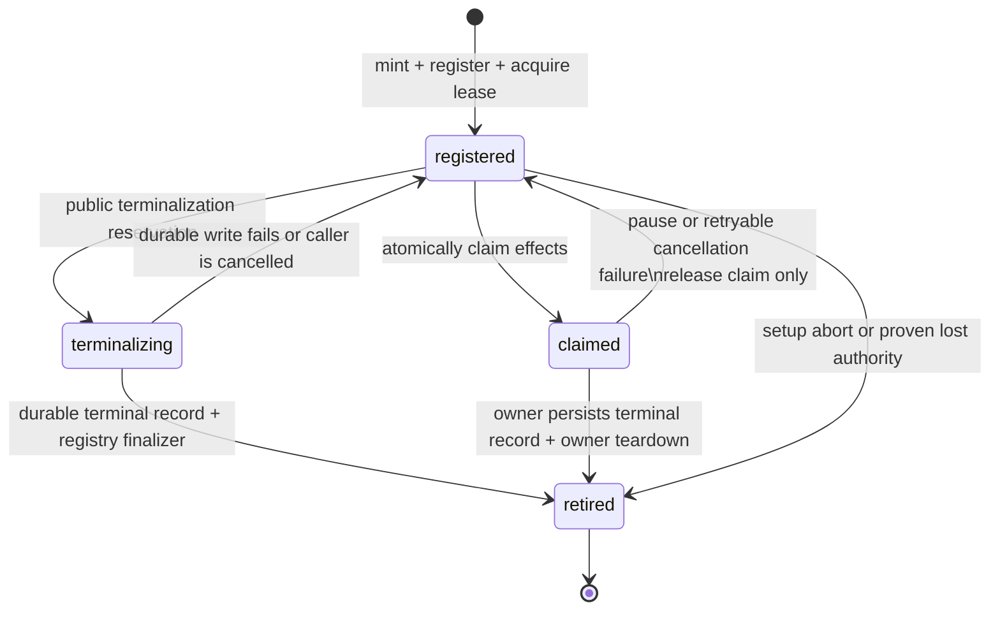

# AC Runtime Execution Authority Boundary

## Status

Proposed Foundation A replacement for the closed implementation PRs #1682,
#1704, #1705, and #1706. This document deliberately selects the conservative first
boundary: every currently supported CLI runtime is executable **only within
its creating process**. No existing CLI runtime can claim portable execution
identity until it is rebuilt around the sealed kernel described below.

Foundation A's persisted authority contract is identity-only. This replacement
also defines the process-local lifecycle required to keep that identity
truthful while effects are active. It does not authorize result reuse,
checkpoint reuse, trust reuse, dispatch, routing, acceptance, or cross-run
learning.

## Review-derived approval constraints

The four closed implementation PRs are evidence for hard exclusions in this
replacement, not a backlog of helper names to bind later:

| Review evidence | Rejected assumption | Binding rule in this replacement |
| --- | --- | --- |
| #1682 | A growing snapshot of workspace, runtime, verifier, dispatcher, rate gate, and executor objects can prove portable behavior | Never infer portable authority by recursively inspecting live Python objects |
| #1704 | More callable/global/credential inspection can make that open object graph complete and safe to serialize | Canonical authority contains only finite declarative data; dynamic behavior and credential-shaped values force process-local scope |
| #1705 | A narrow legacy CLI allowlist can be portable if enough launch and helper fields are enumerated | Every existing CLI runtime is process-local; portability requires a separate sealed execution kernel with a closed effect path |
| #1706 | Runner, heartbeat, retained MCP owner, and public cancellation may each perform their own terminal cleanup | One registry owns one lifecycle entry per session; other surfaces request transitions and durable terminal state has one CAS winner |

These constraints may not be relaxed by a follow-up patch in Foundation A. A
future proposal that needs portability, routing, or reuse must introduce its own
reviewed authority rather than widening this boundary.

## Problem

The prior designs tried to promote `CodexCliRuntime` to portable identity by
binding its public `execute_task` method and an expanding set of configuration
fields. That is not a finite effect boundary: the unchanged public method
dynamically resolves `_execute_task_impl`, command builders, event handlers,
local skill/MCP handlers, process hooks, and caches. Binding each newly found
helper would turn Foundation A back into an unbounded inspection of a Python
object graph.

Consequently, an unchanged public `execute_task` could dispatch a changed
post-construction helper while the contract was still marked portable. A
portable claim made under those conditions is false and must not be an input to
later reuse or acceptance decisions.

## Foundation A contract

`ExecutionAuthorityContract` is a canonical, digest-only snapshot with these
components:

| Component | Portable treatment | Process-local treatment |
| --- | --- | --- |
| Executor policy | Closed versioned declarative values owned by the executor | Invalid/unknown values add a live-instance nonce |
| Workspace | Canonical workspace identity; a future portable kernel must also bind an immutable workspace generation | Missing/unsafe identity or a missing future generation adds a nonce |
| Built-in verifier | Closed implementation version and declarative configuration | Custom, dynamic, or unsafe verifier adds a nonce |
| Runtime | **No legacy CLI runtime is portable in Foundation A** | Runtime type and all runtime execution behavior are scoped to one live instance |
| Prompt, AC, tool list, model override, effort, session/handle, checkpoint | Excluded; attempt input | Excluded; Foundation C owns it |
| Event store, queues, locks, signal hubs, local handler caches, globals, closures, monkeypatches | Excluded | Live process state |

The canonical JSON contains only safe, finite declarative values or their
digests. It never recursively hashes callables, closures, descriptors,
globals, modules, environment maps, handler maps, cache contents, or opaque
objects. Credential-shaped values are never serialized; they force the owning
component to process-local.

Every dynamically or unsafely identified process-local component receives an
opaque random nonce once per **authority generation**.
`ExecutionAuthorityLiveBinding` retains that nonce for its same-instance
integrity rechecks; a new executor/runtime capture gets a new nonce. Two
instances may have similar visible configuration, but they cannot compare as a
portable authority or accidentally authorize cross-process reuse.

More precisely, a nonce is attached to each component whose own identity is
dynamic, unsafe, or otherwise not canonically observable. A valid declarative
workspace or policy descriptor need not receive a separate nonce merely because
another component makes the *whole* authority process-local. In Foundation A
every current runtime is such a component, so its live nonce makes the complete
authority generation process-local even when the workspace and policy retain
their finite declarative descriptors.

An authority generation additionally has a non-serializable live capability
held in the process-local registry by session id. The persisted event contract
may record `scope: "process_local"` and a correlation id, but never contains
that capability. Deserializing the correlation id in another process is
evidence only: it cannot recreate the capability or authorize an effect.

The registry alone mints generations and accepts registrations; it exposes no
public "register this correlation id" or caller-constructed capability path.
It records the exact minted object and its creating PID. After `fork`, the
child replaces the registry state and lock, so inherited memory cannot act as
a parent capability and cannot deadlock on a lock held by a vanished parent
thread. A child must create a fresh authority generation for a fresh attempt.

`portable_across_processes` is an identity-stability predicate only. It is
false for every current CLI runtime. There is no
`reusable_across_processes` alias: reuse is a later, separately authorized
decision in Foundation C and the Final Gate.

## Runtime rule

`CodexCliRuntime`, `CopilotCliRuntime`, `ZcodeCLIRuntime`, and every custom or
subclassed runtime remain fully executable. Their dynamic helpers, local skill
interception, MCP-handler caches, profile loaders, environment reads, launcher
chains, and resume recovery hooks are normal live-process behavior, not a
portable authority declaration.

Foundation A must not call a runtime's dynamic identity provider while
constructing a portable witness. A runtime may expose a descriptor for logging
or same-process diagnostics, but that descriptor cannot upgrade its stability.

The supported legacy runtime catalog is the factory's complete set: Codex,
OpenCode, Hermes, Gemini, Antigravity, Grok, Kiro, Copilot, Goose, Pi, GJC,
Zcode, and all custom/subclassed adapters. Tests enumerate that catalog rather
than relying on a prose list.

The executor may still capture its own fixed entry functions to prevent an
accidental internal dispatch through a replaced executor method. That is a
local integrity check, not a proof that an arbitrary runtime's whole Python
implementation is portable.

## Future portable runtime: sealed execution kernel

A future, separate proposal may admit one portable runtime only by introducing
an explicit `SealedExecutionKernel`. It must not wrap or call the legacy
runtime's dynamically resolved `self._...` helpers on the portable path.

Its finite data and collaborators must be:

1. an immutable `LaunchSpec` containing the canonical executable chain,
   working directory, allowed child-environment snapshot, permissions, fixed
   timeouts, and bounded process policy;
2. a fixed parser/normalizer implementation table whose functions are captured
   at kernel construction and invoked directly;
3. a direct subprocess launcher collaborator captured at construction;
4. no local skill interception, mutable MCP handler cache, session-signal hub,
   arbitrary callback, or dynamic profile/config lookup on the portable path;
5. a versioned closed implementation identifier, with reviewed source changes
   requiring a version bump; and
6. an immutable settled-workspace generation/snapshot, rather than a path-only
   workspace identity; and
7. a live guard that validates the kernel object and its exact finite
   collaborators before it produces an executor-owned effect.

Local interception and any unsupported configuration must route to the legacy
process-local runtime instead. The sealed kernel is deliberately deferred; it
is not simulated by a long allowlist of legacy helper methods.

## Consumer rules

Foundation B may attach an authority fingerprint to attempt and final-acceptance
events as diagnostic attribution, but a process-local fingerprint or correlation
id must never be used as an event-deduplication key, replay/idempotency key,
trust key, reusable-result key, or final-acceptance key. Foundation B's
replay-safe final event will have its own authority-generation semantics.

The runner records the authority scope when a new run starts. On resume it must
check the live generation capability **before** looking up
`execution_identity_contract`, a resume-selector provider, or any other
runtime-owned dynamic collaborator. If a `process_local` session has no live
capability, resume terminates with a typed `process_local_resume_unavailable`
outcome and an operator must start a new attempt; it must never silently fall
back to a stale session, a cached pass, or a newly computed runtime descriptor.

This is also a deployment boundary: a one-shot detached worker may retain an
owner while it remains alive, but its handler-local runner and capability leave
with that worker. A later request handled by a different worker therefore
returns `process_local_resume_unavailable`; it is not a durable-resume path and
must not attempt to recreate the prior owner from its stored correlation data.

For a new process-local session, the runner validates/allocates the session id,
registers the registry-minted capability, and acquires its PID-and-boot-time
liveness lease **before** it persists the durable `RUNNING` tracker. If either
registration or lease acquisition fails, no `RUNNING` tracker is published.
The lease is liveness evidence only; it never transfers or reconstructs the
opaque authority capability.

Effectful execution atomically claims the live session capability. A second
same-process caller receives `process_local_execution_in_progress` and must
not terminalize or retire the original caller. `PAUSED` releases **only** that
exclusive claim: its registry registration/capability and liveness lease remain
held by the original owner. Only a durable terminal winner retires the
registration, issuance, claim, and owned lease. A raw task cancellation or
failed terminal write releases the exiting coroutine's claim, active route, and
worktree lock while preserving the exact owner for retry.

On a valid process-local resume, a foreign runner or observer must treat either
a live registry registration or a live liveness lease as an active owner and
return the non-terminal typed block
`process_local_authority_held_elsewhere`. It produces the terminal
`process_local_resume_unavailable` result only when **both** the matching
registry registration and liveness lease are absent. This distinguishes an
active process from a crashed/exited owner without treating a lock as portable
authority.

The MCP handler retains a paused process-local owner strongly. A same-handler
resume selects the exact retained runner, adapter, and handler-owned
`EventStore`; it does not reconstruct a fresh runtime or capability from the
persisted correlation id. Because pausing releases the task-worktree lock, the
handler restores that exact workspace and reacquires its lock before the
retained runner resumes. The retained event store stays open while paused and
is closed only after that runner reaches a terminal state.

New process-local session ids must pass the canonical safe-id validation before
registration or lease acquisition. For an old/corrupt persisted id that is not
safe, heartbeat observers derive a containment-safe hashed lookup filename;
they do not use the raw value as a path and cannot register it as a new
authority. Heartbeat observers never delete stale or malformed lease records:
their read is non-atomic, and removal could race with a new holder. Such a
record simply cannot prove liveness.

Contracts created before this schema have no Foundation A authority scope. They
are not migrated into the new authority model: a runner that cannot prove a
same-process generation rejects their resume explicitly. This is a deliberate
fail-closed migration rule, not a claim that old persisted runtime descriptors
were portable.

Foundation C may support same-process capsule continuation for a process-local
generation. Cross-process fresh-session continuation is locked behind the
sealed-kernel prerequisite: until that kernel is approved, a process restart
produces the explicit terminal/new-attempt path above. A later C sub-slice may
enable cross-process continuation only when every component is portable and its
capsule contract is independently valid.

## Process-local lifecycle ownership

The process-local registry is the sole in-process owner of the authority
generation's lifecycle. It stores one lifecycle entry per session with one
explicit, mutually exclusive state; claim and terminalization are not parallel
maps that can both appear owned. It has a deliberately small state machine; runner,
MCP execution, and public cancellation surfaces may request a transition, but
they must not each infer a separate terminal lifecycle.

`registered` holds the opaque generation, registration, heartbeat lease, and
registered terminal finalizers. `claimed` adds the one exclusive right to
perform effects. `terminalizing` is not a second effect owner: it is a
reservation held only while a public terminal surface writes its durable record
for an otherwise unclaimed paused owner. `retired` contains none of those
resources. A session must never be both durably terminal and locally
`registered` after a successful terminalization path completes.

### Terminalization API

The registry exposes four lifecycle operations, all keyed by the exact
session/execution/correlation tuple:

| Operation | Preconditions | Result |
| --- | --- | --- |
| `claim` | `registered`, no effect claim or reservation | moves to `claimed`; a competing caller receives the non-terminal in-progress block |
| `release` | exact current effect owner | returns `claimed` to `registered`, preserving the registration and lease for a paused/retryable owner |
| `begin_terminalization` | `registered` and unclaimed | reserves `terminalizing`; an active claim or another reservation is signalled instead of being terminalized underneath |
| `retire_after_terminal_persistence` | a durable terminal record has already succeeded | atomically removes registration, claim/reservation, issuance, and finalizer set, then drains the captured finalizers |

Only the final operation is allowed to run the retained-owner cleanup callbacks.
The callbacks close retained `EventStore` instances, evict handler-held runners,
release heartbeat/worktree state through their exact owner, and are idempotent.
They are registered against the opaque live binding rather than reconstructed
from persisted diagnostic data. If cancellation reaches the caller while this
finalizer set is draining, the drain still completes every callback before that
caller cancellation is re-raised. A cancelled or failing individual callback is
logged and cannot prevent subsequent cleanup callbacks from running.

Normal runner-owned completion persists its terminal tracker before performing
its own teardown. A public terminal surface follows the same order, but first
takes `begin_terminalization`; it has no authority to mint/reconstruct a
runner. This gives the paused retained owner and the public MCP surface one
shared transition instead of two competing cleanup paths.

Authority-loss failure and public cancellation use an additional durable
transition guard: `append_session_terminal_if_active`. It checks for an
explicit session terminal event and appends the new terminal event in the same
database transaction. For SQLite it takes the immediate write transaction;
the per-session unique terminal-transition guard provides the same one-winner
property on other supported stores. The outcome is either one durable winner or
a successful no-op because another terminal event already won. A stale
`PAUSED`/`RUNNING` snapshot therefore cannot append `FAILED` over a concurrent
`CANCELLED` record after the registry has retired its local generation.

The session terminal CAS is the durable source of truth. A runner persists that
transition before emitting the `execution.terminal` projection used by
single-stream consumers. If its requested transition loses, it reconstructs
the durable winner and projects that status instead; it never publishes a
`completed` or `failed` execution mirror before the session winner is known.

### Cancellation and resume race matrix

| Situation | Durable action | Local authority result | Caller-visible outcome |
| --- | --- | --- | --- |
| A local worker is `claimed`; public cancel arrives | Do not write a terminal record underneath it; publish the cooperative request | claim remains with worker until its orderly cancellation path | successful `cancellation_requested` response; worker performs persistence and teardown |
| A local paused owner is `registered`; public cancel arrives | reserve first, publish request, then write `CANCELLED` | reservation blocks a concurrent resume claim; successful write retires and drains all finalizers | terminal cancellation response |
| The paused-owner cancellation write fails or its caller is cancelled | no terminal record is reported | release only the reservation; preserve registration, lease, and published cancellation request | retryable error/caller cancellation; retained owner retries before any next effect |
| Worker cancellation persistence fails | no false `CANCELLED`/`FAILED` record | release exiting worker's effect claim, active route, and worktree lock; retain registration, heartbeat, and cancellation request | typed `cancellation_persistence_pending`; next same-process resume retries cancellation before executing effects |
| MCP execution wrapper receives `cancellation_persistence_pending` | must not call `mark_failed` | retains the exact owner and its liveness until a successful terminal write | retryable nonterminal error |
| A stale paused/running snapshot observes authority retirement after a public terminal write | conditional terminal append finds the existing terminal event and does not append `FAILED` | no generation is recreated or retired a second time | fail-closed resume error while the durable terminal status remains unchanged |
| A concurrent same-owner resume occurs during a claim or terminalization reservation | no competing terminal write | `claim` fails without releasing the live owner or its worktree state | `process_local_execution_in_progress` |
| A foreign live process holds the heartbeat lease and public cancel arrives | publish a file-backed nonterminal request; do not write terminal state beneath its effects | no local registration is manufactured or retired; the owner observes the request at its normal checkpoints | successful `cancellation_requested`; an unavailable signal path returns a retryable persistence error |
| A local or foreign claimed owner receives a public cancellation reason/actor | preserve `reason` and `cancelled_by` in the in-memory or file-backed request metadata | the exact owner consumes the metadata when it wins `CANCELLED`; no controller writes terminal state beneath it | durable session cancellation retains CLI/MCP/JobManager attribution instead of runner defaults |
| The owning runner commits `CANCELLED` and is repeatedly cancelled during acknowledgement/projection | the durable winner remains `CANCELLED` | marker clearing, execution projection, authority/heartbeat retirement, route removal, and workspace release drain in one shielded child task | no terminal/live-owner coexistence window remains |
| A terminal record is written through a public paused-owner cancellation | call `retire_after_terminal_persistence` only after the write | registry atomically detaches the opaque binding, then finalizers evict runner/cache/store and lease resources | later resume sees terminal state and cannot leak a retained owner |
| A raw caller cancellation interrupts pre-effect contract/tool setup after a claim | first drain any published cooperative cancellation in a shielded task | successful cancellation retires normally; failed persistence releases only the claim/route/lock and preserves retryable authority | cancellation result or `cancellation_persistence_pending`, never `PAUSED → FAILED` through lost authority |
| Setup or execution raises and the `FAILED` transition cannot persist | no false terminal result is reported | release only claim/route/worktree; retain registration and heartbeat for the same owner | typed `terminal_persistence_pending`; wrapper must retain rather than manufacture another failure |

The `claim` and terminalization reservation are intentionally the same mutual
exclusion boundary. Thus a resume cannot acquire effects between public-cancel
preflight and persistence. The implementation still treats an observed
post-write active claim defensively: it republishes cancellation for that owner
to complete orderly teardown rather than silently deleting its live state.

## Exit matrix

The Foundation A implementation must demonstrate all of the following:

1. exact current CLI runtimes, their subclasses, custom runtimes, custom
   verifiers, local skill dispatch, local handler caches, and signal hubs are
   process-local;
2. changing `_execute_task_impl`, `_build_command`, a local handler cache, or
   `execution_identity_contract` after capture never leaves a runtime marked
   portable;
3. no runtime descriptor, credential-shaped value, callable closure/global, or
   cache contents appear in canonical authority JSON;
4. two process-local runtime captures receive distinct fingerprints even when
   configured alike, while a live binding retains its captured nonce for a
   same-instance recheck;
5. workspace, built-in verifier, and closed executor-policy divergence change
   the identity; malformed or unsafe values fail closed to process-local;
6. executor-owned fixed entry-root drift is rejected before its next owned
   effect, while runtime helper drift is explicitly outside the portable
   guarantee; and
7. no public Foundation A API says or implies that a portable identity grants
   reuse, dispatch, result, checkpoint, trust, routing, or final acceptance.
8. a new run registers its non-serializable generation capability; same-process
   resume retains it, while a reconstructed process-local contract without that
   capability rejects before any dynamic runtime identity or resume-selector
   provider is invoked;
9. a correlation id, forged or deserialized generation, or forked child cannot
   register a live authority; issuance and registration are registry-private
   and PID-bound;
10. only one caller may hold an effectful claim for a session, while a second
    caller fails non-terminally and a live `RUNNING` holder is never
    terminalized by an observer;
11. a `RUNNING` tracker whose registry capability and liveness lease have both
    disappeared takes the explicit terminal/new-attempt path;
12. process-local authority data is attribution only and cannot be used by an
    attempt/final-event reducer as a dedupe, replay, trust, or acceptance key;
    and
13. every runtime-factory backend and a subclass/custom adapter are classified
    process-local, the boundary matrix lists `legacy_runtime_descriptor` only
    under `process_local`, and legacy persisted contracts without the new scope
    marker take the explicit fail-closed migration path.
14. registry registration and the held liveness lease precede durable `RUNNING`
    persistence; a failed lease acquisition rolls the registration back without
    publishing a recoverable-looking session;
15. `PAUSED` releases only the effect claim, and the same handler's retained
    runner/adapter/EventStore resumes only after it has reacquired the paused
    worktree lock; a concurrent or foreign resume returns a typed non-terminal
    result without calling `mark_failed`; and
16. heartbeat lookup is contained for unsafe legacy ids, while observers retain
    stale/malformed lease files rather than deleting liveness evidence they did
    not own.
17. a public terminalization reserves an unclaimed paused generation before its
    durable write, blocks concurrent effect claims, and releases that reservation
    without retiring the owner when the write or its caller fails;
18. a failed worker cancellation write releases the departed effect claim,
    active route, and worktree lock while preserving the live registration,
    heartbeat, and cancellation request for an exact-owner retry;
19. the MCP wrapper preserves retryable cancellation/terminal-persistence state
    rather than manufacturing `FAILED`; a foreign resume receives the typed
    ownership block, while a foreign public cancel publishes a durable
    nonterminal request instead of writing terminal state beneath active effects;
20. an externally persisted terminal record drains the exact retained runner,
    handler cache, heartbeat, worktree ownership, and owned EventStore through
    the registry's one finalizer path; and
21. caller cancellation and a cancelled/failing finalizer cannot skip the
    remaining registered finalizers or leave the registry reservation behind.
22. competing `FAILED`/`CANCELLED` session lifecycle writes have exactly one
    durable winner, and a stale pre-terminal tracker cannot overwrite that
    terminal status after authority retirement; and
23. a raw task cancellation in every claimed-but-pre-effect setup window drains
    a published cooperative cancellation before generic cleanup, or preserves
    the explicit retryable cancellation state for the next exact-owner resume.
24. every live session is represented by one registry lifecycle entry whose
    state is exactly one of `registered`, `claimed`, or `terminalizing`; a claim
    and a terminalization reservation cannot coexist.
25. a runner emits `execution.terminal` only after the session terminal CAS has
    selected a durable winner, and a CAS loser projects the winner rather than
    its stale requested status.
26. replay and pre-aggregated session-activity snapshots both treat an explicit
    `COMPLETED`, `FAILED`, or `CANCELLED` lifecycle event as absorbing; a late
    `runtime_status: running` progress checkpoint cannot make orphan detection
    or another snapshot consumer observe the session as active again.
27. setup and execution exception handlers persist or observe a terminal winner
    before retiring authority or liveness; if that write fails, they preserve an
    unclaimed same-process owner and return `terminal_persistence_pending`.
28. cancellation issued from a separate CLI/MCP process reaches a live owner
    through a containment-safe file-backed request marker, which is distinct
    from both the heartbeat lease and terminal session evidence.
29. a transient or persistent `COMPLETED` write failure retries or preserves
    the original completion intent; no generic exception funnel may rewrite a
    successful runtime result as `FAILED`.
30. cancellation after a durable terminal CAS but before projection/cleanup
    reconstructs the terminal winner and retires local authority instead of
    restoring a live owner beside `COMPLETED`, `FAILED`, or `CANCELLED`.
31. an MCP background task cancelled before its first coroutine turn retains
    its exact owner and owned EventStore when lost-authority terminalization
    cannot persist, and reconciles cleanup only after reading a terminal record.
32. cancellation racing `create_session` reconstructs the allocated durable
    identity under shielding; a committed `RUNNING` start is terminalized before
    retirement, while an unreadable publication retains its exact owner/lease.
33. a caller-supplied terminal tracker is never authority for cleanup; the
    durable session must independently prove a terminal status before the
    process-local registration or heartbeat can be retired.
34. an MCP preparation error that retains `terminal_persistence_pending` also
    retains its handler-owned EventStore through the enclosing handler cleanup,
    so the exact owner remains genuinely callable for retry.
35. post-CAS reconciliation drains under shielding across repeated task
    cancellation for both owning-runner and public-cancellation paths; only
    after cleanup completes does the original cancellation propagate.
36. every failed `create_session` return, raised exception, cancellation, and
    identity-mismatch response crosses the same durable-publication boundary:
    definite absence retires, a committed start terminalizes, and ambiguous
    persistence retains the exact owner instead of guessing.
37. a sequential recoverable failure reports `PAUSED` only after
    `mark_paused()` succeeds; persistence failure returns typed
    `pause_persistence_pending` while retaining the exact owner and lease.
38. a parallel recoverable failure applies the same durable pause boundary and
    cannot emit `execution.terminal(status=paused)` over durable `RUNNING`.
39. a recoverable failure during resume applies the same durable pause boundary
    and cannot return a resumable success while pause persistence is pending.
40. a cross-process cancellation marker arriving during parallel pause
    publication remains pending after the claim is released, so the next exact
    owner terminalizes it before effects.
41. a cross-process cancellation marker arriving during resumed pause
    publication is likewise preserved; only a terminal lifecycle path may
    acknowledge and clear it.
42. once `PAUSED` is durable, failure of the auxiliary execution-terminal
    projection, frugality proof, or retrospective cannot route through generic
    `FAILED` cleanup in sequential, parallel, or resumed execution.
43. CLI cancellation preserves the typed distinction between a durable
    `CANCELLED` winner and `CANCELLATION_REQUESTED`; single and `--all` output
    and counts never report a live-owner request as completed cancellation.
44. PAUSED publication is conditional on the absence of an explicit terminal
    winner in the same persistence transaction; sequential, parallel, and
    resumed runners reconstruct a losing terminal winner, project it, and
    retire authority, heartbeat, routing, and workspace ownership.
45. for sessions without a live process-local owner, `UnitOfWork` routes
    exported terminal session events through the same one-winner EventStore
    append instead of `append_batch`; both a CAS winner and loser are
    successful commits and leave no permanently pending event.
46. `cancel --all` counts marker/session persistence failures separately from
    skipped or requested sessions, prints retry guidance, and never reports
    "No running executions" when an active cancellation attempt failed.
47. a retained owner preserves the full pending `COMPLETED`, `FAILED`, or
    `PAUSED` transition payload in process-local state; the next exact-owner
    resume retries that transition before runtime arbitration or effects, then
    reconciles projection and ownership from the durable result.
48. `UnitOfWork` is not lifecycle authority: it rejects a terminal event for
    any session with a live process-local registry entry, leaving both the
    pending event and resumable owner intact for owner-mediated terminalization.
49. `UnitOfWork` also rejects terminal events when a different live process
    holds the session heartbeat lease; a foreign writer cannot bypass the
    owning process merely because its local registry is empty.
50. after the owning runner commits `CANCELLED`, cooperative request clearing,
    execution-terminal projection, authority and heartbeat retirement, active
    route removal, and workspace release drain under shielding across repeated
    caller cancellation.
51. cooperative cancellation preserves the caller's bounded `reason` and
    `cancelled_by` metadata through both the same-process registry and the
    atomic file-backed cross-process channel; the owning runner uses that
    metadata for the durable session cancellation event.
52. retained `COMPLETED` and `FAILED` intent replay reconstructs the durable
    winner after an interrupted terminal CAS response; a committed winner
    retires authority, heartbeat, active routing, and workspace ownership
    instead of preserving a contradictory retry owner.
53. generic failure cleanup applies the same post-CAS reconstruction before
    returning persistence-pending or propagating cancellation, so a committed
    terminal winner cannot coexist with live process-local resources.
54. lost-authority terminalization reconciles an interrupted conditional
    `FAILED` write under shielding before deciding whether terminal intent must
    remain pending.
55. preparation-failure terminalization uses the same durable-winner boundary;
    cancellation after a committed `FAILED` append drains the early authority
    and heartbeat before it propagates.
56. an interrupted public cancellation with an unreadable post-CAS winner
    keeps its exact owner in non-effectful `TERMINALIZING` state; a later
    cancellation request retries durable reconciliation and retires a proven
    terminal winner instead of restoring execution authority.
57. the active-runner cancellation entry point forwards the caller's bounded
    `reason` and `cancelled_by` metadata unchanged to the cooperative request
    consumed by terminal persistence.
58. active-runner cancellation interrupted immediately after its conditional
    `CANCELLED` write reconstructs the durable winner under shielding; a
    committed winner drains authority, heartbeat, routing, and workspace
    ownership before the original cancellation propagates.
59. an unreadable public-cancellation result keeps a non-effectful retryable
    `TERMINALIZING` reservation, and a later cancellation request may reclaim
    that reservation to retry the terminal CAS when durable state is still
    `RUNNING` or `PAUSED`.
60. one session aggregate has exactly one immutable `session.started` identity:
    concurrent creation and caller-supplied reuse cannot append a second start
    event, including when the public event factory is committed through
    `UnitOfWork`.
61. resume replays pending lifecycle intent and arbitrates persisted
    process-local authority before evaluating current fat-harness or investment
    policy; lost or foreign authority cannot be masked by a newer policy gate.

This exit matrix is intentionally narrower than an arbitrary-code sandbox and
broader than a cosmetic fingerprint: it makes the only cross-process claim
that Foundation A can currently prove, which is that it makes no such claim
for legacy dynamic runtimes.
